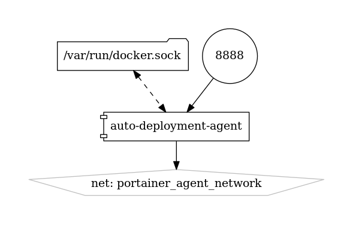
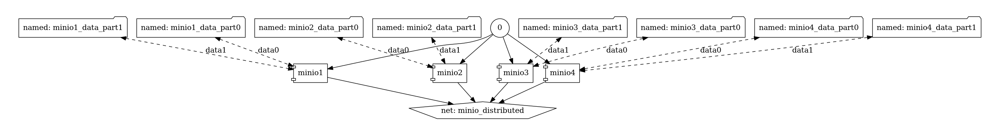
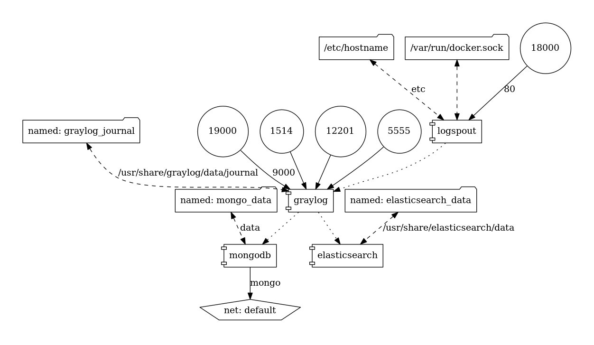
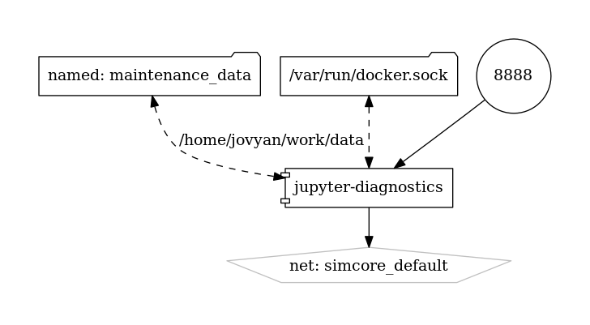
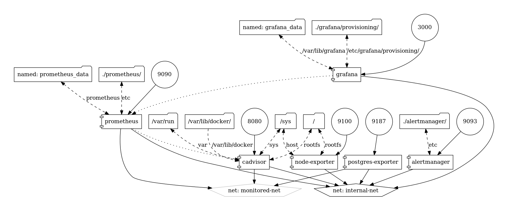
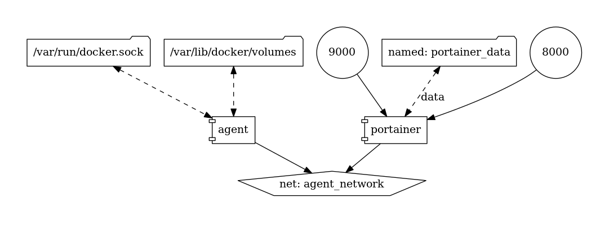

# Design of Stacks 

    $ cd services/$(stack-name)
    $ make build test release

    $ make up
    $ make down

## deployment-agent

## minio 

This is an example for 4 replicas and 2 partitions per service

## graylog

## adminer

## maintenance

## monitoring

## portainer

---

Diagrams of the [osparc-simcore stack](https://github.com/pcrespov/osparc-simcore/blob/is1047/remove-minio-and-webclient-from-stack/docs/simcore-stack.md)

---

Updated Sep 12, 2019

Credits https://github.com/pmsipilot/docker-compose-viz
